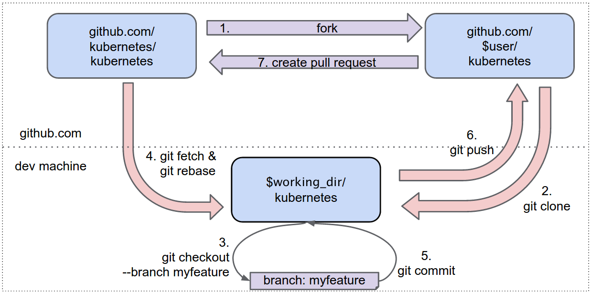

---
author: sn0rt
comments: true
date: 2016-11-01
layout: post
tag: tips
title: git usage
--- 

# 0x00 workflow

git 的工作流程,已 k8s devel 的开发者文档里面图来说明:


首先在 fork 代码，然后 clone 到本地，创建分支并修改代码，commit 发 PR 或者 rebase/fetch 别人的代码后修改发 PR.

## 0x01 tips

* Merge another branch of the same git-repo
```
git merge branch-name
```

* Pick up a specific commit from another branch
```
git cherry-pick commit-name
```

* Merge a branch from another local git repo
```
git pull /path/to/git-repo branch-name
```

* Rebase your commits
```
git rebase -i commit-nameˆ
```

* Rebase a branch onto master
```
git rebase –onto master –root
```

* Delete a remote branch
```
git push origin :branch
```

**Example of generate and release kernel patches**

* Generate patches
```
git format-patch -s –cover-letter –thread commit1ˆ..commit2 –cc="Name <user@example.com>"
```
* Check&fix up your patches `Documentation/SubmitChecklist`, `script/checkpatch.pl` cleanfile
* Release your patches Config send-email:
```
git config, man git-send-email(Sending)
```
* Get maintainers:
```
./scripts/get maintainer.pl
```
* Send out your patch:
```
git send-email –to=”LKML <linux-kernel@vger.kernel.org>” –cc="Maintainers’ Email Address"
```

# 0x10 filter-branch

git 的本质是内容寻址文件系统,有时候需要 undo 操作消除敏感信息是不够的,关于更多 git 底层信息参考 progit[^progit].
有时候脑抽了,把敏感资料或者一个大的 binary commit 上去了,想要补救.

## 0x11 Clear sensitive files

```
$ ls password 
password
$ git filter-branch --index-filter "git rm -rf --cached --ignore-unmatch password" --prune-empty -- --all 
Rewrite be0acf636754aea731c0b1f285142143dbf0275f (2/3) (0 seconds passed, remaining 0 predicted)    rm 'password'
Rewrite c3cc58dc9ebe7cf1f3187a0a6172e1bb274b3921 (3/3) (0 seconds passed, remaining 0 predicted)    rm 'password'

Ref 'refs/heads/master' was rewritten
$  ls
chcon  init
$ git show 100644
fatal: ambiguous argument '100644': unknown revision or path not in the working tree.
Use '--' to separate paths from revisions, like this:
'git <command> [<revision>...] -- [<file>...]'
```

## 0x12 remove the largest file


通过 git 阅读索引文件(拓展名.idx),确认哪个 object 最大

```shell
$ git verify-pack -v .git/objects/pack/pack-f92ea95d8f9a18dd42335fc3e3bd25feb8ed5ef8.idx | sort -k 3 -n | tail -3
1d07197534891b5d45286850f7202dc1f84beceb blob   2885745 2873595 11242780
61ba4967a562aaff8d1208981a2f1be968c969fd blob   8929280 3255190 3940716
353a62618f023052c25db90d5c3f6725cadfbd95 blob   9263612 2936691 73858887
```

查看体积最大的 hash 属于哪个文件

```shell
$ git rev-list --objects --all | grep 353a62618f023052c25db90d5c3f6725cadfbd95
353a62618f023052c25db90d5c3f6725cadfbd95 vendor/github.com/go-openapi/spec/debug.test
```

确认该文件属于哪个 commit

```shell
$ git --no-pager log --pretty=oneline --branches -- vendor/github.com/go-openapi/spec/debug.test 
da1f2c61c603e1cadc89e2cc690d46d2f972501e Update vendor packages (#1378)
```

要移除这个文件需要利用 filter-barch 重写自`da1f2c61c603e1cadc89e2cc690d46d2f972501e`的全部历史,注意 commitid 后面的`^`与`..`

```shell
$ git filter-branch --index-filter 'git rm --cached --ignore-unmatch vendor/github.com/go-openapi/spec/debug.test' -- da1f2c61c603e1cadc89e2cc690d46d2f972501e^..
Rewrite da1f2c61c603e1cadc89e2cc690d46d2f972501e (1/8) (0 seconds passed, remaining 0 predicted)    rm 'vendor/github.com/go-openapi/spec/debug.test'
Rewrite 8c83a03a1b84fd18830b8bfaf1ea09ba5cc93e78 (2/8) (0 seconds passed, remaining 0 predicted)    rm 'vendor/github.com/go-openapi/spec/debug.test'
Rewrite 3fe627bb58a2f081a7976a13dd0b014c5c882bcb (3/8) (0 seconds passed, remaining 0 predicted)    rm 'vendor/github.com/go-openapi/spec/debug.test'
Rewrite dd3ef7d823313445774d2ed577f67d2da37a1568 (4/8) (1 seconds passed, remaining 1 predicted)    rm 'vendor/github.com/go-openapi/spec/debug.test'
Rewrite 0b0bafce155f20be369f35da045fb6338bf38e24 (4/8) (1 seconds passed, remaining 1 predicted)    rm 'vendor/github.com/go-openapi/spec/debug.test'
Rewrite fd18f0e6895bbfc144051e928d8c77a110fb2978 (4/8) (1 seconds passed, remaining 1 predicted)    rm 'vendor/github.com/go-openapi/spec/debug.test'
Rewrite 69e2d04e0f4f69f9c6c0c5d24b4b6b07490d347d (4/8) (1 seconds passed, remaining 1 predicted)    rm 'vendor/github.com/go-openapi/spec/debug.test'
Rewrite 645191d3ff4cf9e898c9e5796b86dc010c095630 (4/8) (1 seconds passed, remaining 1 predicted)    rm 'vendor/github.com/go-openapi/spec/debug.test'
Ref 'refs/heads/master' was rewritten
```

清理 reflog 对象

```shell
$ rm -Rf .git/refs/original
$ rm -Rf .git/logs/
$ git gc
Counting objects: 36023, done.
Delta compression using up to 4 threads.
Compressing objects: 100% (18106/18106), done.
Writing objects: 100% (36023/36023), done.
Total 36023 (delta 16535), reused 35996 (delta 16515)
```

对比一下清理前后,其中`size-pack`是以 kB 为单位进行记录大小的.

```shell
$ git count-objects -v
count: 0
size: 0
in-pack: 36023
packs: 1
size-pack: 77904
prune-packable: 0
garbage: 0
size-garbage: 0

$ git count-objects -v
count: 0
size: 0
in-pack: 36003
packs: 1
size-pack: 77911
prune-packable: 0
garbage: 0
size-garbage: 0
```

[^progit]: [progit](https://git.oschina.net/progit/9-Git-%E5%86%85%E9%83%A8%E5%8E%9F%E7%90%86.html)
